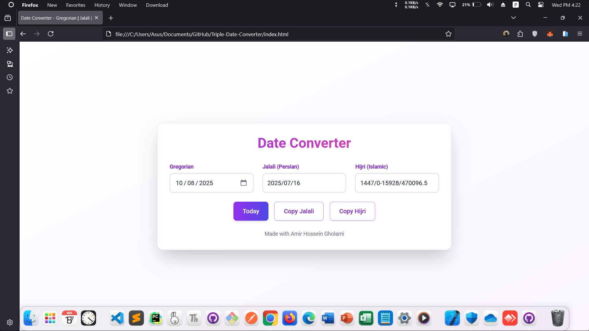

<!-- README.md -->

<a href="https://amirhosseingholami-dev.github.io/Triple-Date-Converter/" target="_blank" style="text-decoration: none; color: inherit;">

<h3>Triple-Date-Converter</h3>
</a>

A lightweight, responsive date converter supporting Gregorian, Jalali (Persian), and Hijri (Islamic) calendars.
Built with vanilla JavaScript, Tailwind CSS, and no external dependencies.
Features real-time conversion, copy-to-clipboard, and "Today" shortcut.

<a href="https://amirhosseingholami-dev.github.io/Triple-Date-Converter/" target="_blank">🎯 Live demo</a> ·
<a href="https://github.com/AmirHosseinGholami-DEV/Triple-Date-Converter/" target="_blank">💻 Source</a>

